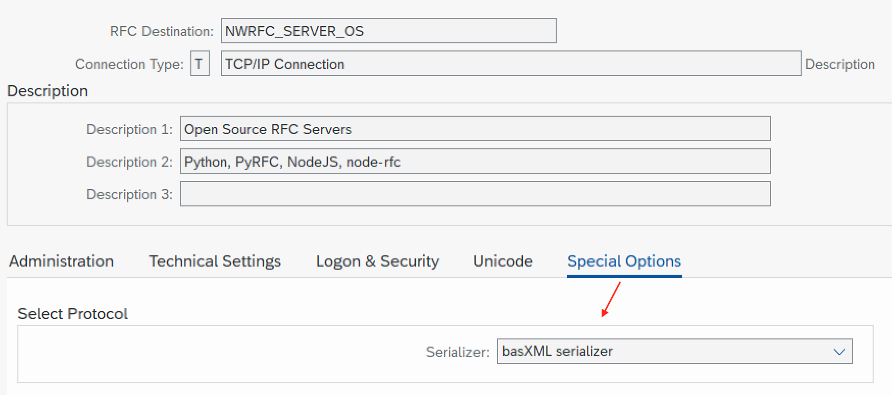
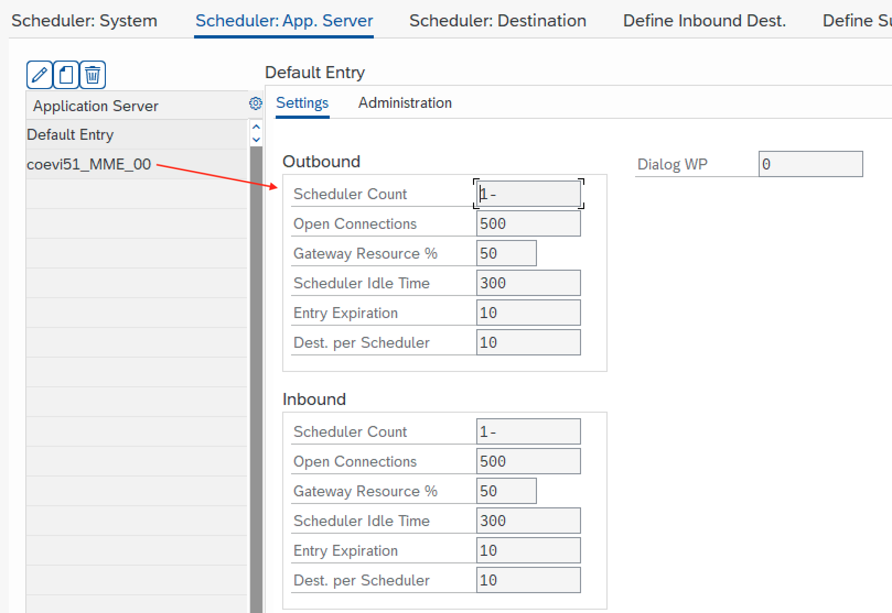
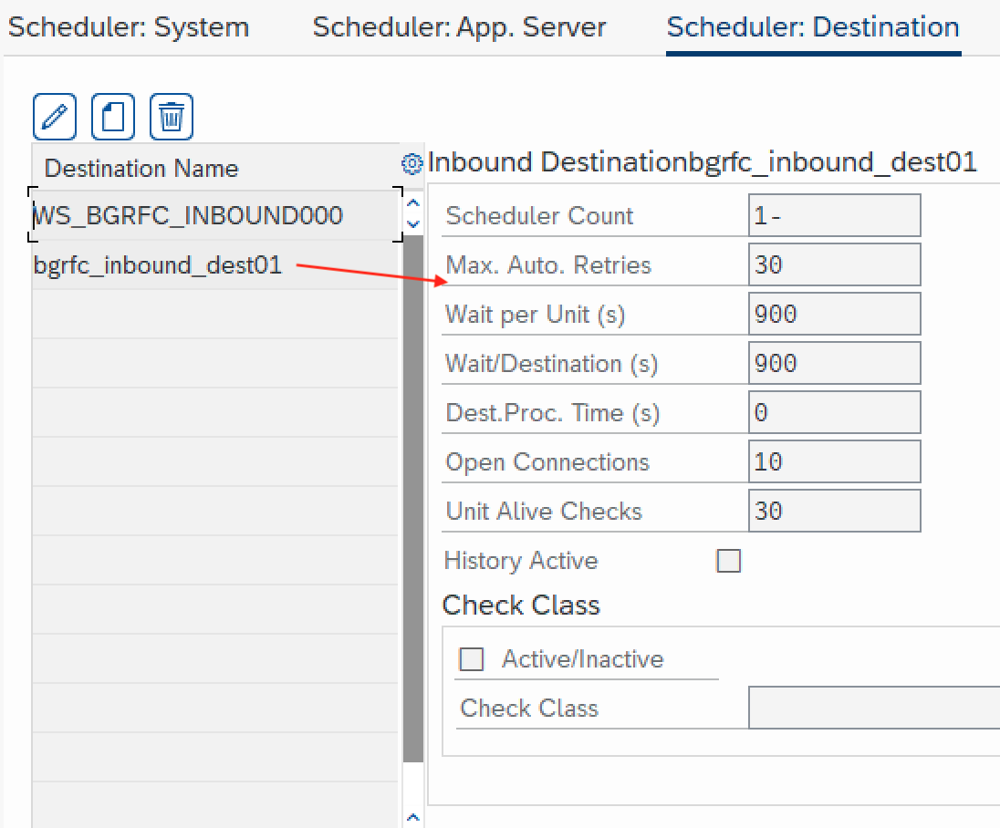
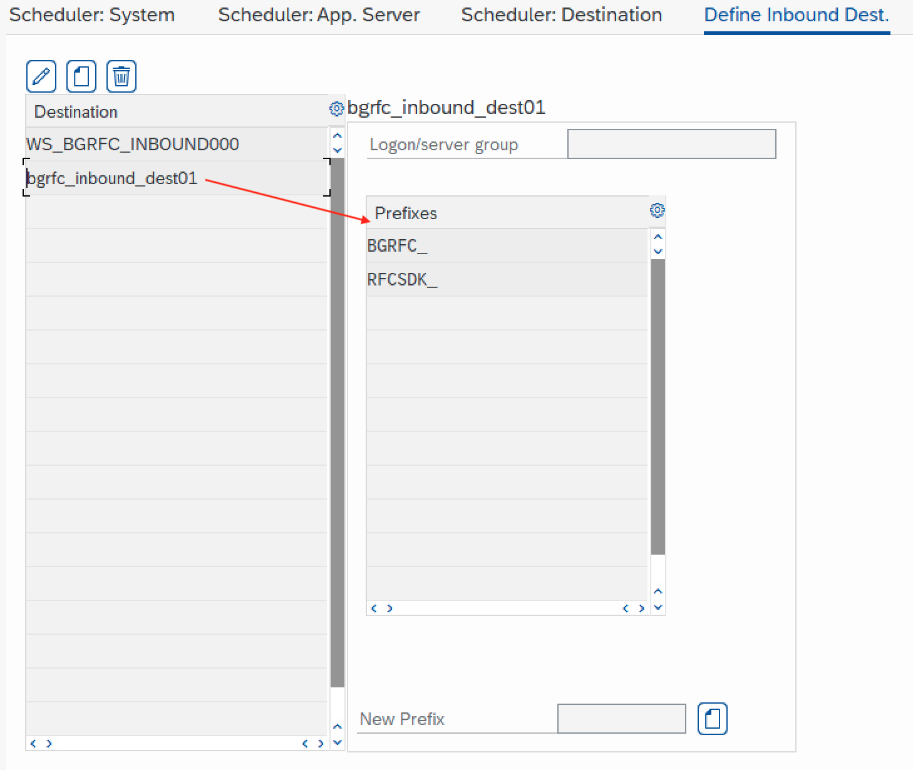

# Background RFC Server

## Configuration

### ALX

Configure RFC destination using SM59 transaction:

- TCP/IP Connection `NWRFC_SERVER_OS`
- Special Options > Select Protocol: basXML serializer



### MME

Configure bgRFC queues using transaction `SBGRFCCONF`

Scheduler app server and destination





Configure inbound destination prefixes for bgRFC queues' names. Other queue names are processed as standard RFC queues.



### Python

- `sapnwrfc.ini`

```ini
DEST=ALX
MSHOST=ldcialx
MSSERV=9914
GROUP=PUBLIC
CLIENT=000
LANG=EN
USER=BOSKOVIC
PASSWD=Kol!ko11

DEST=ALX_GATEWAY
GWSERV=sapgw18
GWHOST=ldai5alx.wdf.sap.corp
PROGRAM_ID=RFCSERVER
REG_COUNT=1

DEST=BCO
MSHOST=ldcsbco
MSSERV=5357
GROUP=PUBLIC
CLIENT=000
LANG=EN
USER=NWRFCTEST
PASSWD=Welcome1
```

## Test

### Python

```python
python examples/server/bgrfc.py
```

### ALX

Run test report `RSBGRFC_T200` with parameters:

- QNAME_O: BASIS_BGRFC_OUTIN
- QNAME_IN: NCO_CONN_JUNIT_QUEUE_BC
- RFCDEST: NWRFC_SERVER_OS
- LOCK_IN: X

### MME

Run transaction `SBGRFCMON` and find the locked queue `NCO_CONN_JUNIT_QUEUE_BC`

Delete the lock, so that queue gets executed.

Run SE16 and check TCPIC table